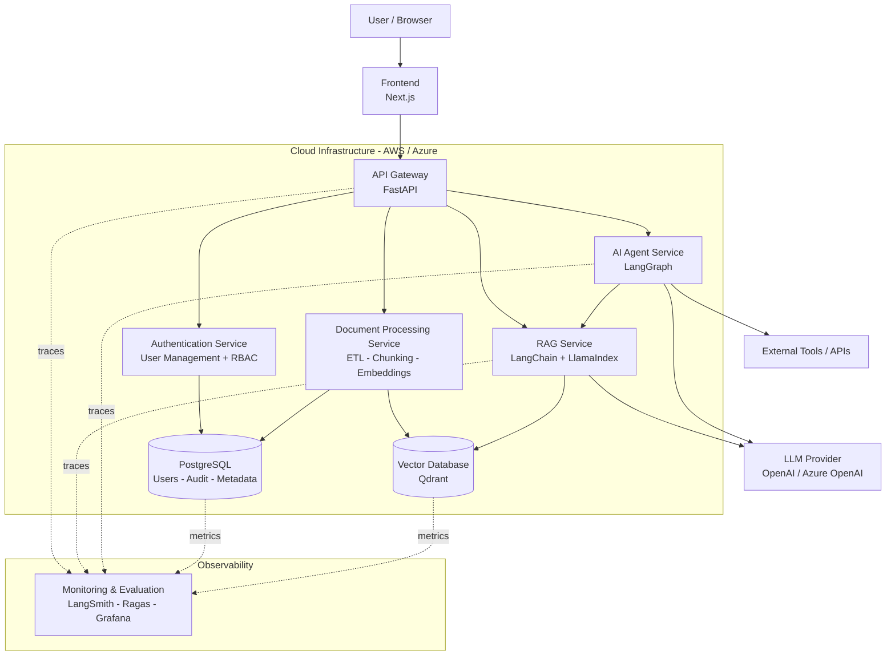
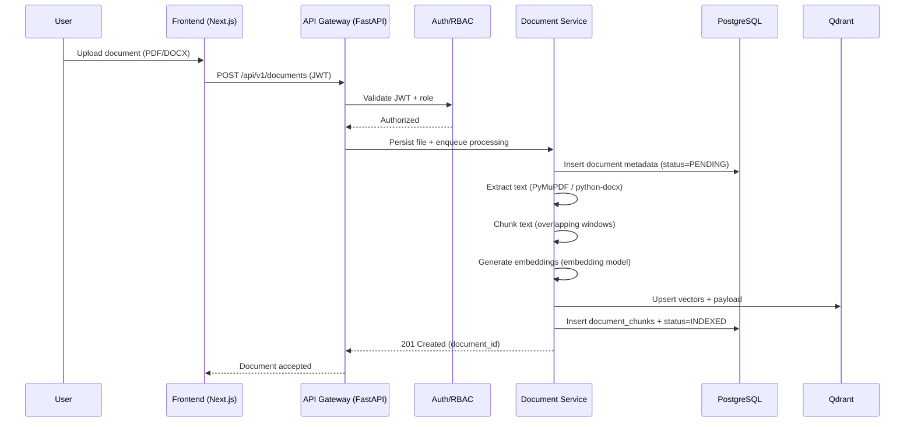
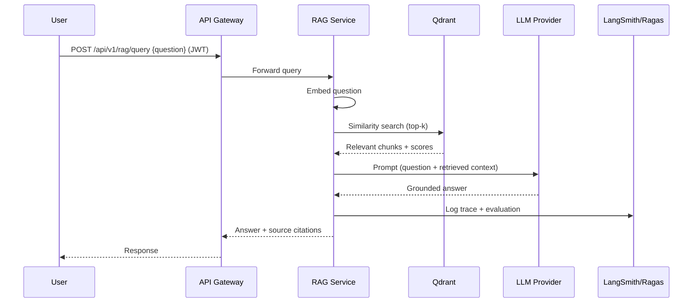
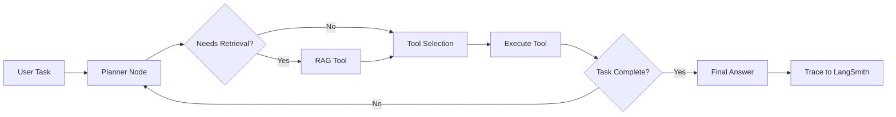
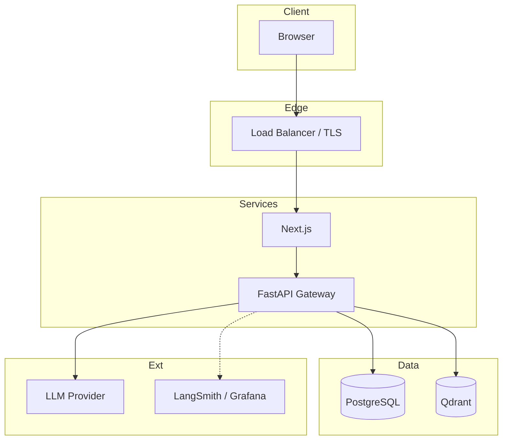

# System Architecture — Enterprise AI Knowledge & Automation Platform

## 1. Overview

The Enterprise AI Knowledge & Automation Platform is a modular, service-oriented
system that ingests enterprise documents, indexes them into a vector store, and
exposes Retrieval-Augmented Generation (RAG) and autonomous AI-agent capabilities
through a secured API. It is designed to demonstrate the full skill set of a modern
Data/AI Engineer: software engineering, data engineering, ML, GenAI, RAG, AI agents,
MLOps/LLMOps, cloud engineering, DevOps, and enterprise security & governance.

This document describes the target architecture across all project phases. Not every
layer is implemented yet — see the [Implementation Status](#7-implementation-status)
section for what exists today versus what is planned.

## 2. High-Level Architecture

## 3. Request & Data Flow

### 3.1 Document Ingestion Flow

### 3.2 RAG Query Flow

### 3.3 AI Agent Flow (LangGraph)

## 4. Component & Technology Choices

| Layer | Technology | Rationale |
|-------|-----------|-----------|
| Frontend | Next.js (React, TypeScript) | SSR/CSR hybrid, strong ecosystem, easy auth integration and streaming UI for chat. |
| API Gateway | FastAPI (Python) | Async, high performance, native OpenAPI/Swagger, Pydantic validation, ideal for AI/ML Python stack. |
| Authentication | JWT (python-jose) + passlib/bcrypt | Stateless tokens scale horizontally; bcrypt for secure password hashing. |
| Authorization | Role-Based Access Control (ADMIN/MANAGER/EMPLOYEE) | Simple, auditable enterprise access model. |
| Relational DB | PostgreSQL + SQLAlchemy 2.0 | ACID guarantees for users, audit logs, and document metadata; mature ORM. |
| Migrations | Alembic | Versioned, reproducible schema changes instead of `create_all`. |
| Document Parsing | PyMuPDF, python-docx | Reliable extraction from PDF and Word documents. |
| Vector Database | Qdrant | High-performance ANN search, payload filtering, easy self-hosting and cloud options. |
| RAG Framework | LangChain + LlamaIndex | LangChain for orchestration/chains; LlamaIndex for advanced indexing/retrieval strategies. |
| Agent Framework | LangGraph | Graph-based, stateful multi-step agent orchestration with cycles and checkpointing. |
| LLM Provider | OpenAI / Azure OpenAI | State-of-the-art models; Azure option for enterprise compliance. |
| Observability | LangSmith, Ragas, Grafana | LangSmith for LLM tracing; Ragas for RAG quality metrics; Grafana for infra/metrics dashboards. |
| Containerization | Docker + Docker Compose | Reproducible local & CI environments; parity with production. |
| Orchestration | Kubernetes (target) | Scalable production deployment. |
| Cloud | AWS / Azure | Managed compute, storage, secrets, and networking. |

## 5. Security & Governance

- **Authentication:** Stateless JWT bearer tokens with configurable expiry.
- **Authorization:** RBAC enforced at the API layer; least-privilege per role.
- **Audit Logging:** All security-relevant actions recorded in `audit_logs`.
- **Secrets Management:** Environment variables (`.env`), never committed; `.env.example`
  documents required keys. Production uses cloud secret managers (AWS Secrets Manager /
  Azure Key Vault).
- **Data Isolation:** Document access scoped by ownership and role.
- **Transport Security:** TLS termination at the gateway/load balancer.

## 6. Deployment Topology

## 7. Implementation Status

| Phase | Scope | Status |
|-------|-------|--------|
| 0 | Planning & system design (this docs set) | In progress |
| 1 | Backend foundation: FastAPI, PostgreSQL, JWT auth, RBAC, audit logging, Alembic | Core complete |
| 2 | Containerization: Dockerfile + docker-compose | Complete |
| 3 | Document ingestion pipeline (ETL, chunking, embeddings) | Planned |
| 4 | Vector database integration (Qdrant) | Planned |
| 5 | RAG service (LangChain + LlamaIndex) | Planned |
| 6 | AI agent service (LangGraph) | Planned |
| 7+ | Monitoring/evaluation, MLOps, cloud deployment, hardening | Planned |

> This architecture is the north star for the roadmap. Layers marked *Planned* define
> the intended integration contracts so that current services (auth, persistence) are
> built with the full system in mind.
