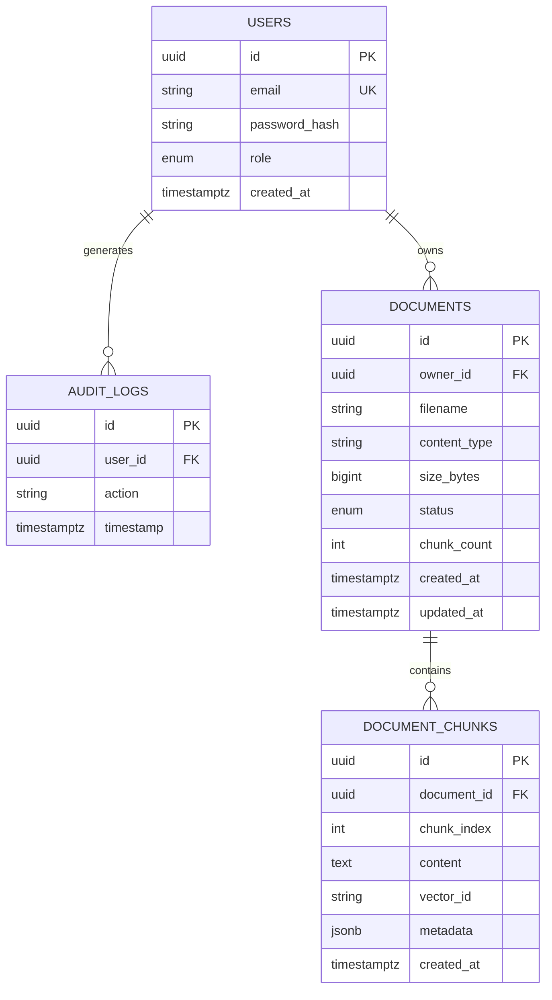

# Database Design — Enterprise AI Knowledge & Automation Platform

## 1. Overview

The platform uses **PostgreSQL** as its relational store, accessed via **SQLAlchemy 2.0**
and versioned with **Alembic** migrations. The relational database holds users, audit
logs, and document metadata (including per-chunk records). The raw vector embeddings
themselves live in the **Qdrant** vector database; the `document_chunks` table stores a
reference (`vector_id`) that links each chunk to its vector in Qdrant.

- **Primary keys:** UUID v4 (`uuid` type).
- **Timestamps:** `TIMESTAMPTZ`, server-defaulted to `now()`.
- **Naming:** snake_case tables and columns.

## 2. Entity-Relationship Diagram

## 3. Tables

### 3.1 `users`

Stores platform accounts and their role for RBAC.

| Column | Type | Constraints | Description |
|--------|------|-------------|-------------|
| id | UUID | PK, default `uuid4` | Unique user identifier. |
| email | VARCHAR | NOT NULL, UNIQUE, indexed | Login identifier. |
| password_hash | VARCHAR | NOT NULL | bcrypt hash of the password. |
| role | ENUM(`ADMIN`,`MANAGER`,`EMPLOYEE`) | NOT NULL, default `EMPLOYEE` | RBAC role. |
| created_at | TIMESTAMPTZ | server default `now()` | Account creation time. |

**Indexes:** PK on `id`; unique index on `email`.

### 3.2 `audit_logs`

Append-only record of security-relevant actions for governance.

| Column | Type | Constraints | Description |
|--------|------|-------------|-------------|
| id | UUID | PK, default `uuid4` | Log entry identifier. |
| user_id | UUID | FK → `users.id`, NULLABLE | Actor (nullable for system/anonymous events). |
| action | VARCHAR | NOT NULL | Action name (e.g. `LOGIN`, `REGISTER`, `DOCUMENT_UPLOAD`). |
| timestamp | TIMESTAMPTZ | server default `now()` | When the action occurred. |

**Indexes:** PK on `id`; recommended index on `user_id` and `timestamp` for querying.
**Relationships:** `user_id` → `users.id` (`ON DELETE SET NULL` recommended to preserve history).

### 3.3 `documents`

*Phase 3.* Metadata for each uploaded document and its processing lifecycle.

| Column | Type | Constraints | Description |
|--------|------|-------------|-------------|
| id | UUID | PK, default `uuid4` | Document identifier. |
| owner_id | UUID | FK → `users.id`, NOT NULL | Uploading user. |
| filename | VARCHAR | NOT NULL | Original file name. |
| content_type | VARCHAR | NOT NULL | MIME type (e.g. `application/pdf`). |
| size_bytes | BIGINT | NOT NULL | File size in bytes. |
| status | ENUM(`PENDING`,`PROCESSING`,`INDEXED`,`FAILED`) | NOT NULL, default `PENDING` | Ingestion status. |
| chunk_count | INTEGER | NOT NULL, default `0` | Number of chunks produced. |
| created_at | TIMESTAMPTZ | server default `now()` | Upload time. |
| updated_at | TIMESTAMPTZ | server default `now()`, on update `now()` | Last status change. |

**Indexes:** PK on `id`; index on `owner_id`; index on `status`.
**Relationships:** `owner_id` → `users.id` (`ON DELETE CASCADE`).

### 3.4 `document_chunks`

*Phase 3/4.* One row per text chunk; links to its embedding vector in Qdrant.

| Column | Type | Constraints | Description |
|--------|------|-------------|-------------|
| id | UUID | PK, default `uuid4` | Chunk identifier. |
| document_id | UUID | FK → `documents.id`, NOT NULL | Parent document. |
| chunk_index | INTEGER | NOT NULL | Ordinal position within the document. |
| content | TEXT | NOT NULL | Raw chunk text. |
| vector_id | VARCHAR | NULLABLE, indexed | ID of the vector in Qdrant (`NULL` until indexed). |
| metadata | JSONB | NULLABLE | Page numbers, headings, and other extraction metadata. |
| created_at | TIMESTAMPTZ | server default `now()` | Creation time. |

**Indexes:** PK on `id`; index on `document_id`; unique composite index on
`(document_id, chunk_index)`; index on `vector_id`.
**Relationships:** `document_id` → `documents.id` (`ON DELETE CASCADE`).

## 4. Relationships Summary

| Parent | Child | Cardinality | On Delete |
|--------|-------|-------------|-----------|
| users | audit_logs | 1 → many | SET NULL |
| users | documents | 1 → many | CASCADE |
| documents | document_chunks | 1 → many | CASCADE |

## 5. Vector Store Linkage (Qdrant)

Embeddings are stored in a Qdrant collection (e.g. `document_chunks`), keyed by the same
identifier saved in `document_chunks.vector_id`. Each Qdrant point payload carries
`document_id`, `chunk_id`, and `owner_id` to support filtered, access-controlled search.
This separation keeps the relational database lean while enabling high-performance ANN
retrieval.

## 6. Migration Strategy

- Schema changes are managed exclusively through **Alembic** (`alembic revision
  --autogenerate` → review → `alembic upgrade head`).
- The legacy `Base.metadata.create_all()` call is retained only for quick local bootstrap
  and will be superseded by migrations in production.
- The initial migration captures the `users` and `audit_logs` tables; `documents` and
  `document_chunks` are introduced in the Phase 3 migration.
